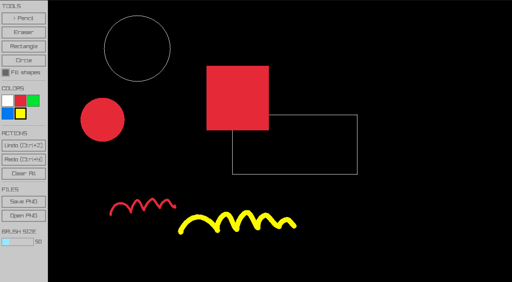

# WhiteBoard

A simple drawing application built with [raylib](https://www.raylib.com/) and [raygui](https://github.com/raysan5/raygui).



## Features

- **Drawing Tools**
  - Pencil - freehand drawing with interpolated circles for smooth strokes
  - Eraser - erase with black (background color)
  - Rectangle - draw rectangles (filled or outline)
  - Circle - draw circles (filled or outline)

- **Color Palette** - 5 colors: white, red, green, blue, yellow

- **Actions**
  - Undo/Redo - up to 50 history states
  - Clear All - reset canvas to black
  - Save PNG - export with timestamp (e.g., `whiteboard_260113_173542.png`)
  - Open PNG - load `whiteboard.png`

- **Other**
  - Resizable window with dynamic canvas
  - Adjustable brush size (1-50)
  - Fill shapes option
  - Cursor hidden while drawing

## Controls

| Action | Control |
|--------|---------|
| Draw | Left mouse button |
| Pencil | `1` |
| Eraser | `2` |
| Rectangle | `3` |
| Circle | `4` |
| Undo | `Ctrl+Z` |
| Redo | `Ctrl+Y` |
| Save | `Ctrl+S` |
| Open | `Ctrl+O` |

## Building

### Requirements

- C++20 compiler
- CMake 4.1+
- raylib

### macOS

```bash
# Install raylib via Homebrew
brew install raylib

# Build
cd WhiteBoard
mkdir build && cd build
cmake ..
cmake --build .

# Run
./WhiteBoard
```

### Linux (Arch)

```bash
# Install dependencies
sudo pacman -S raylib cmake base-devel

# Build
cd WhiteBoard
mkdir build && cd build
cmake ..
cmake --build .

# Run
./WhiteBoard
```

### Linux (Ubuntu/Debian)

```bash
# Install dependencies
sudo apt install libraylib-dev cmake build-essential

# Build
cd WhiteBoard
mkdir build && cd build
cmake ..
cmake --build .

# Run
./WhiteBoard
```

## Project Structure

```
WhiteBoard/
├── CMakeLists.txt
├── main.cpp
├── src/
│   ├── Canvas.cpp/h    # Drawing surface with undo/redo
│   ├── Editor.cpp/h    # Main app logic and GUI
│   └── Palette.cpp/h   # Color palette
└── external/
    └── raygui.h        # GUI library (header-only)
```

## License

MIT
